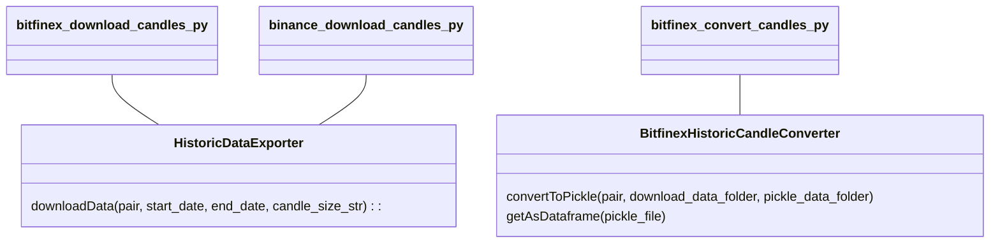

Centralized crpyto exchanes are valuable sources for obtaining trading data.
Data is needed for many purposes, one of them is backtesting of trading strategies.

There are plenty of scripts out there which does the job. 
Here is mine, which I tried to make as easy to understand as possible.

# Implementation details
##My generic folder structure:
- [x] config: Contains exchange access credentials
- [x] data: storage for downloaded and converted data
- [x] scripts: Scripts you can execute
- [x] source: Classes implementing the functionality

## Implementation

